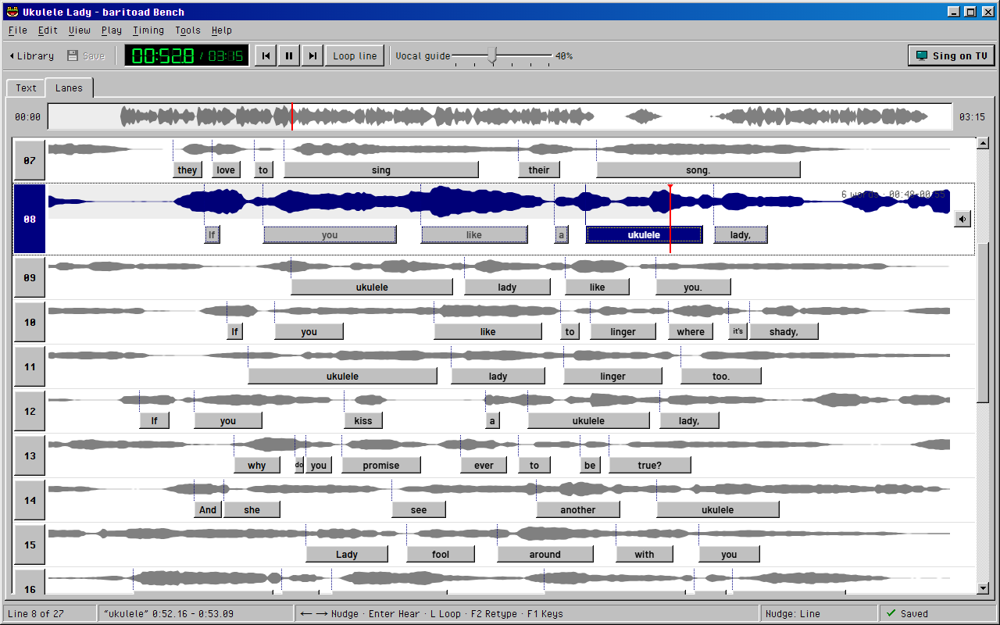
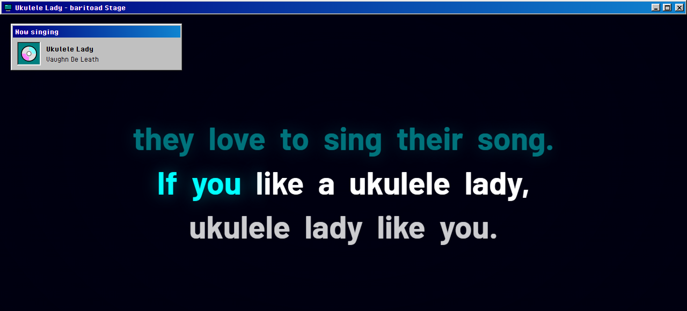
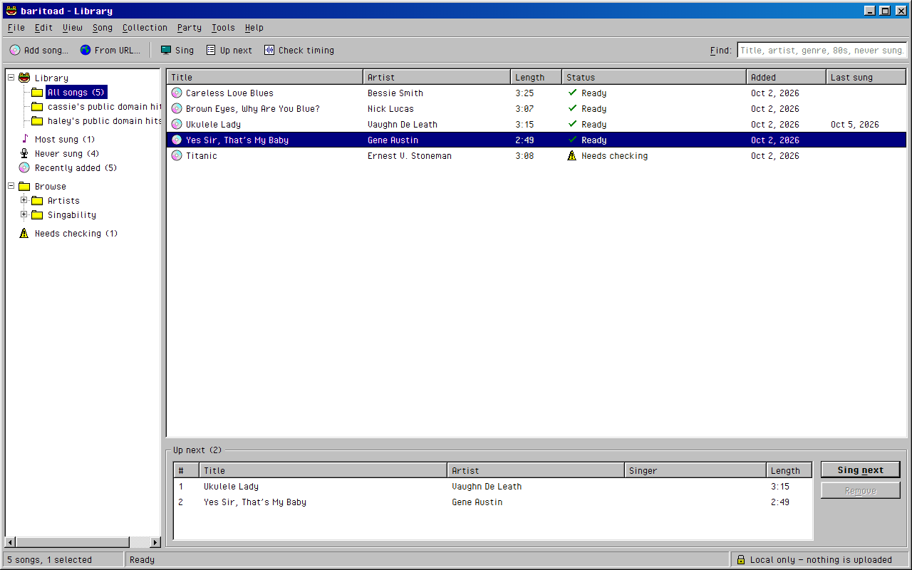

# baritoad

karaoke for the songs nobody made a karaoke version of.

drop in a song you have. baritoad turns the singer down, times the lyrics word
by word, and puts them on your tv. friends pick songs from their phones. free,
open source, and it all runs on your computer.



## download

**[windows 10 or 11, 64-bit](https://github.com/whithr/baritoad/releases/latest)** · mac & linux later

the installer isn't signed yet, so windows may warn you: **more info → run
anyway**. the first start downloads about 2 GB of models.

it's not studio karaoke — sometimes you'll still hear a little of the
original singer.

<p>
  
  
</p>

## privacy

no account, no telemetry, nothing uploaded. it only goes online for the
models, lyrics lookups and links you ask for, and party mode
([what the relay sees](docs/PARTY.md)).

## build

```
cd apps/desktop
pnpm install
pnpm fetch-tools
pnpm tauri dev
```

more in [apps/desktop/README.md](apps/desktop/README.md) ·
[contributing](CONTRIBUTING.md)

## license

[GPL-3.0-or-later](LICENSE). model and dependency licenses:
[MODEL_LICENSES.md](MODEL_LICENSES.md), [docs/DEPENDENCIES.md](docs/DEPENDENCIES.md)
— the demucs separation weights are, per their author, for research use.

*Additional permission under GNU GPL version 3 section 7:* if you modify this
program, or any covered work, by linking or combining it with Microsoft
DirectML or NVIDIA CUDA, cuDNN or TensorRT (or a modified version of those
libraries), containing parts covered by the terms of those libraries'
licenses, the licensors of this program grant you additional permission to
convey the resulting work.
